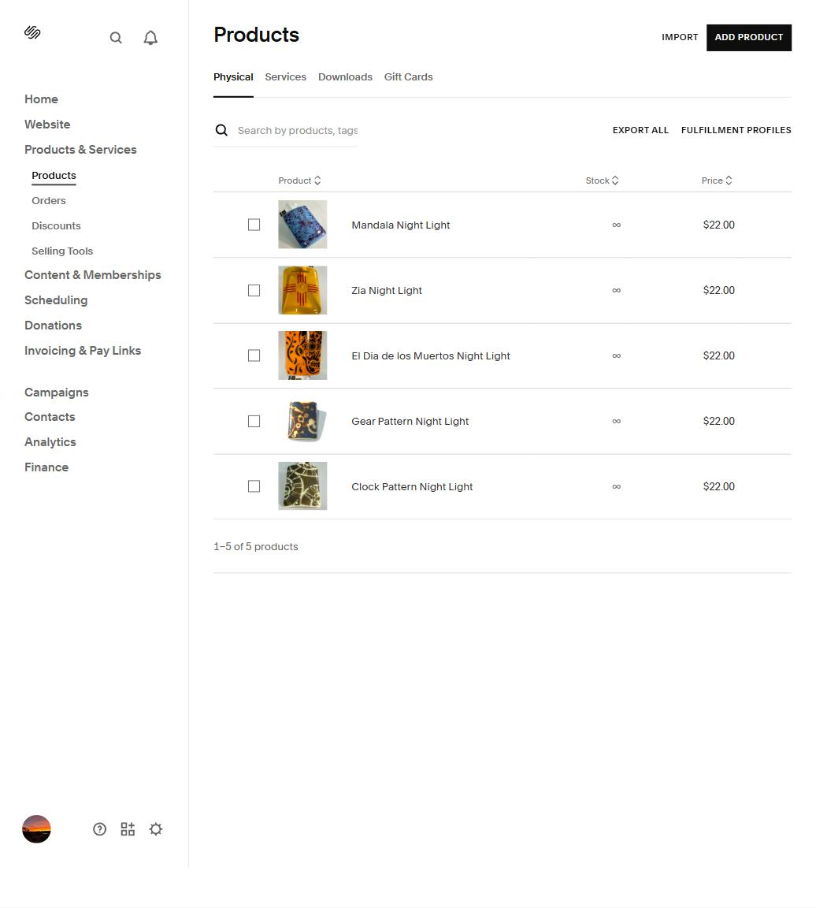
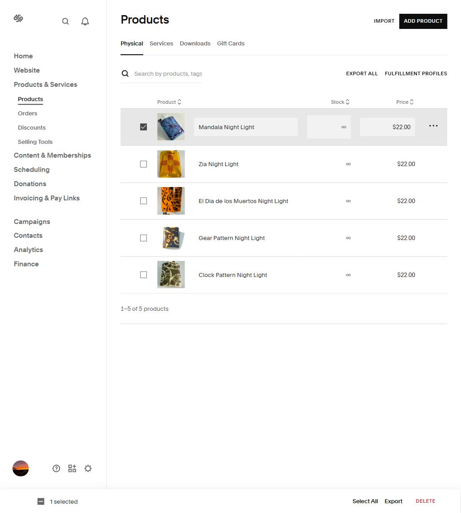
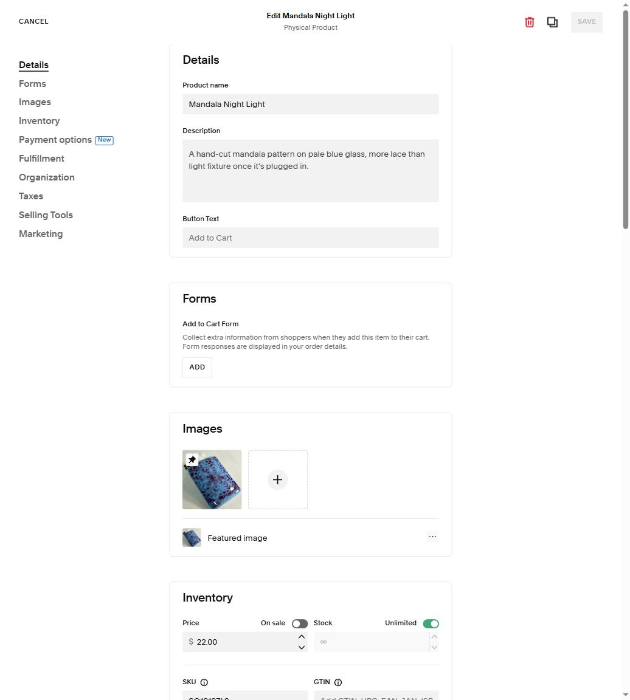
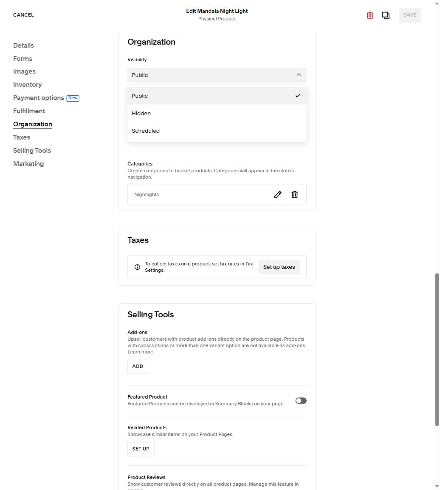

# Managing Your Shop — Quick Guide

This is for Brooke: how to add, remove, or hide a product in your Squarespace shop, on your
own, with no code and no need to wait on anyone. Everything below happens right inside your
normal Squarespace site editor, logged in as yourself.

**Where to go:** click into your site admin, then in the left sidebar:
**Website → Products & Services → Products**

That's the same screen for everything below.

## Add a new product

1. On the Products screen, click **Add Product** (top right) → **Physical**.
2. Fill in: product name, description, at least one photo, and the price.
3. Under **Organization → Categories**, pick which category it belongs in (Nightlights,
   Serving Pieces, etc.) — or add a new category right there if it's a new kind of piece.
4. Click **Save**, then choose **Publish** so it goes live on the site immediately. (You can
   also choose **Save as Hidden** if it's not ready to sell yet — see "Hide a product" below.)

## Remove a product permanently

1. On the Products list, check the box next to the product (or products) you want gone.
2. Click **Delete** at the bottom of the screen, then confirm.

**This can't be undone** — the product, its photos, and its description are gone for good.
If there's any chance you'll want it back, use **Hide** instead (next section).

You can also delete (or edit, preview, or duplicate) a single product from its own row: click
the **⋯** at the right edge of that row.

## Hide a product (without deleting it)

This is the one to use for anything temporary — sold out, seasonal, or not ready yet. Hiding
keeps everything (photos, price, description) exactly as it is, just takes it off the live
shop page. You can switch it back to visible any time, instantly.

1. Click into the product (click its name, or **Edit** from the **⋯** menu).
2. Go to the **Organization** tab in the left list inside the product.
3. Find **Visibility** and change it from **Public** to **Hidden**.
4. Click **Save**.

To bring it back, do the same thing in reverse — open the product, set Visibility back to
**Public**, Save.

(There's also a **Scheduled** option here, which lets you set a future date for a product to
go live automatically — handy if you want to line up a new piece for a specific day.)

## A couple of things worth knowing

- **Categories are shared** across the whole shop — if you add a new category while creating
  a product, it'll show up as a filter option for everyone browsing the shop, not just that
  one item.
- **None of this needs Claude Code, a developer, or anyone else.** This is exactly the same
  admin screen used to build the initial catalog — you have full access to it as the site
  owner, and Squarespace is built for shop owners to run their own catalog day to day.
- If something looks different from these screenshots, Squarespace does update its interface
  from time to time — the core idea stays the same: products live under
  **Products & Services → Products**, and visibility/hide lives inside each product's
  **Organization** tab.

*Screenshots current as of October 2026.*
